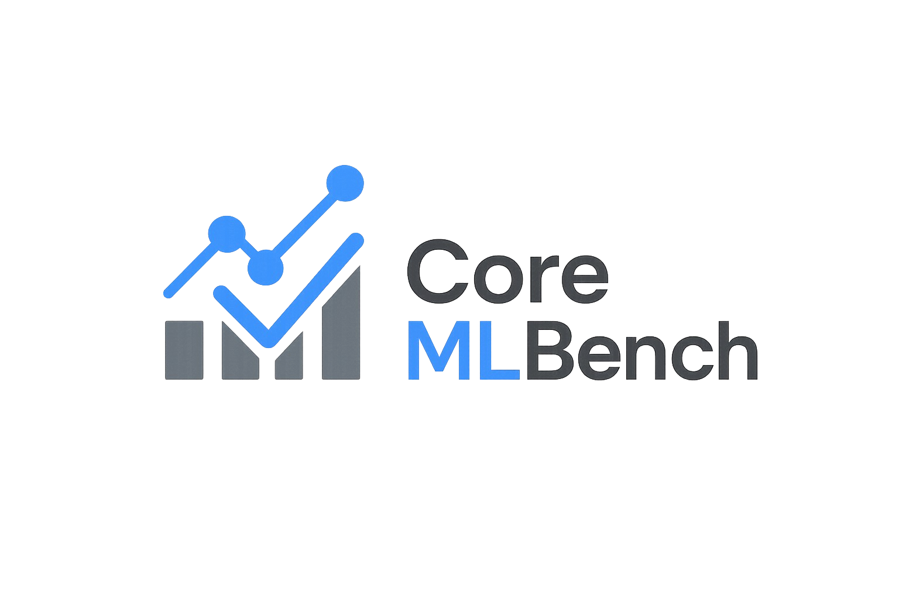

# CoreMLBench

*A hands-on benchmarking suite for classic machine learning algorithms—compare your own implementations with scikit-learn on real tasks!*

---

## Features

- **From-Scratch Implementations**
  - Linear Regression (closed-form and gradient descent)
  - Logistic Regression (multiclass, OvR)
  - K-Nearest Neighbors (KNN) for regression and classification
  - Decision Trees for regression and classification
- **Library Comparisons**
  - scikit-learn’s LinearRegression, LogisticRegression, KNeighbors, and DecisionTree models
- **Reproducible ML Workflow**
  - Data preprocessing, train/val/test split, and feature standardization
  - Hyperparameter tuning for all models (custom and sklearn)
  - Strict separation of validation and test data
- **Experiment Tracking**
  - All trained models saved in `models/` (organized by task and type)
  - All predictions, metrics, and logs saved in `outputs/`
  - Markdown summaries for each experiment
- **Extensible & Educational**
  - Modular codebase for easy extension and learning
  - Jupyter notebooks for step-by-step exploration

---

## How It Works

1. **Preprocess Data:** Clean, split, and standardize features for fair comparison.
2. **Train & Tune:** Fit both custom and sklearn models, tuning hyperparameters on the validation set.
3. **Evaluate:** Assess all models on the untouched test set.
4. **Save Everything:** Store models, predictions, and experiment logs for reproducibility.
5. **Summarize:** Write markdown summaries and a final project-wide report.

---

## Quickstart

Clone the repo and install requirements:
```bash
git clone https://github.com/yourusername/CoreMLBench.git
cd CoreMLBench
pip install -r requirements.txt
```

Run the notebooks in `notebooks/` to reproduce all experiments and results.

---

## Project Structure

```
CoreMLBench/
├── data/                # Raw and processed datasets
├── models/              # Saved models (custom & sklearn, by task)
├── notebooks/           # Jupyter notebooks for regression & classification
├── outputs/             # Predictions, metrics, plots, and experiment logs
├── src/                 # Custom ML algorithm implementations
├── tests/               # Unit tests for custom models
├── requirements.txt     # Python dependencies
├── README.md            # This file
└── RESULTS.md           # Final project summary
```

---

## Acknowledgements

- Inspired by classic ML textbooks and the scikit-learn project.
- See `outputs/summary.md` for a detailed discussion of results.

---

*For questions or contributions, open an issue or pull request!*
